# hmall 项目修改记录

> 本文档记录了 2026-07-07 至 2026-07-15 期间对 hmall（枫叶商城）前后端项目的全部修改，涵盖搜索、下单、支付、类型对齐、精度保护、工程化、Redis 基础设施、验证码登录、Token 续期、前端新页面、秒杀系统、管理后台、项目重命名等模块。

---

## 1. 总览

| 项目 | 数据 |
|------|------|
| 时间跨度 | 2026-07-07 ~ 2026-07-15 |
| 修改文件 | 150+ 文件（前后端） |
| 涉及模块 | search-service, trade-service, pay-service, item-service, cart-service, user-service, admin-service, hm-common, hm-api, hm-gateway, hmall-frontend |
| 核心领域 | ES 搜索修复、雪花 ID 精度保护、前后端 DTO 对齐、下单/支付链路、购物车状态管理、工程稳定性、Redis 基础设施、Token 续期与黑名单、验证码登录、前端 P0/P1 新页面、**高并发秒杀系统**、**RBAC 管理后台**、项目重命名 |

### 演进阶段总览

```mermaid
flowchart LR
    subgraph Day1 ["07-07 ~ 07-08"]
        P1["Phase 1<br/>搜索修复"]
        P2["Phase 2<br/>精度保护"]
        P3["Phase 3<br/>下单支付"]
        P4["Phase 4<br/>购物车修复"]
        P5["Phase 5<br/>DTO对齐"]
        P6["Phase 6<br/>工程化"]
    end

    subgraph Day2 ["07-09 ~ 07-10"]
        P7["Phase 7<br/>订单扩展"]
        P8["Phase 8<br/>日志稳定性"]
        P9["Phase 9<br/>Token续期"]
        P10["Phase 10<br/>Redis基础设施"]
    end

    subgraph Day3 ["07-13 ~ 07-14"]
        P11["Phase 11<br/>验证码登出"]
        P12["Phase 12<br/>Redis稳健性"]
        P13["Phase 13<br/>前端新页面"]
    end

    P1 --> P2 --> P3 --> P4 --> P5 --> P6
    P6 --> P7 --> P8 --> P9 --> P10
    P10 --> P11 --> P12 --> P13

    style P1 fill:#e3f2fd,stroke:#1976d2
    style P2 fill:#fff3e0,stroke:#f57c00
    style P3 fill:#fce4ec,stroke:#c62828
    style P4 fill:#e8f5e9,stroke:#388e3c
    style P5 fill:#ede7f6,stroke:#5e35b1
    style P6 fill:#e0e0e0,stroke:#616161
    style P7 fill:#f3e5f5,stroke:#7b1fa2
    style P8 fill:#e0f2f1,stroke:#00796b
    style P9 fill:#fff8e1,stroke:#ff8f00
    style P10 fill:#ffebee,stroke:#b71c1c
    style P11 fill:#e8eaf6,stroke:#283593
    style P12 fill:#fce4ec,stroke:#ad1457
    style P13 fill:#e8f5e9,stroke:#2e7d32
```



---

## 2. Phase 1: 搜索功能修复（2026-07-07）

> **目标**：修复搜索页面"总商品数恒为 10000"、"筛选后总数不变"、"无分页条"、"价格排序不生效"四个问题。

### 2.1 搜索总数恒为 10000，筛选后不变

**根因**：`SearchServiceImpl.search()` 未启用 `trackTotalHits(true)`，ES 7.x 默认只精确统计到 10000 条，超出返回 `total.value = 10000`。

**文件**：`hmall/search-service/.../SearchServiceImpl.java`

**修复**：
```java
// searchSourceBuilder.query(...) 之后，search() 之前加一行
searchSourceBuilder.trackTotalHits(true);
```

### 2.2 无分页条

**分析**：`SearchPage.vue` 源码中已包含完整的 `<el-pagination>`（第 145-154 行），条件 `v-if="total > 0"` 与头部"共 {{total}} 件"使用同一 ref。逻辑上两者一定同时出现。

**结论**：如能看到共 10000 件但无分页条，说明运行的是旧版 nginx jQuery `search.html`（仅 prev/next 箭头），而非 Vue `SearchPage.vue`。Vue 代码本身正确。

### 2.3 价格排序不生效

**根因**：`SearchServiceImpl.search()` 第 110-111 行硬编码排序为 `_score DESC, update_time DESC`，完全忽略了前端传入的 `sortBy` / `isAsc` 参数。

**修复**：改为动态排序——

```java
String sortBy = query.getSortBy();
if (StringUtils.hasText(sortBy)) {
    SortOrder order = Boolean.TRUE.equals(query.getIsAsc()) ? SortOrder.ASC : SortOrder.DESC;
    searchSourceBuilder.sort(new FieldSortBuilder(sortBy).order(order));
} else {
    searchSourceBuilder.sort("_score", SortOrder.DESC);
    searchSourceBuilder.sort(new FieldSortBuilder("update_time").order(SortOrder.DESC));
}
```

---

## 3. Phase 2: 数据精度保护（2026-07-07 ~ 2026-07-08）

> **目标**：解决雪花 ID（19 位）经 JSON 序列化后，JS Number 精度丢失导致订单/支付 ID 错误的问题；同时保证分页数值（total/pages）以数字形式传递。

### 3.1 Long → String 全局序列化

**背景**：`JsonConfig.java` 将所有 `Long` 序列化为 String，保护 JS `Number.MAX_SAFE_INTEGER`（16 位）之外的雪花 ID，但副作用是 `PageDTO.total/pages` 也变成了字符串。

### 3.2 PageDTO Long → Integer

**文件**：`hmall/hm-common/.../PageDTO.java`

**修复**：`total` / `pages` 字段从 `Long` 改为 `Integer`，所有 `of()` / `empty()` 工厂方法中用 `.intValue()` 转换。分页数值不存在超限风险。

### 3.3 恢复 Long → String 并配合 PageDTO Integer

最终方案：保留 `Long → String`（保护雪花 ID）+ `PageDTO.total/pages` 为 `Integer`（数字传给前端）。

**文件**：
- `hmall/hm-common/.../JsonConfig.java`：保留 `serializerByType(Long.class, ToStringSerializer.instance)`
- `hmall/hm-common/.../PageDTO.java`：total/pages 改为 Integer

### 3.4 前端雪花 ID 类型对齐

**文件**：
- `hmall-frontend/src/types/index.ts`
- `hmall-frontend/src/api/order.ts`
- `hmall-frontend/src/api/pay.ts`
- `hmall-frontend/src/views/portal/PayPage.vue`

**修复**：

| 字段 | 类型变更 |
|------|---------|
| `OrderVO.id` | `number → string` |
| `PayOrderFormDTO.id` | `number → string` |
| `PayApplyDTO.bizOrderNo` | `number → string` |
| `PayOrderVO.id, bizOrderNo` | `number → string` |
| `createOrder()` 返回值 | `Promise<number> → Promise<string>` |
| `getOrderById()` 参数 | `id: number → id: string` |
| `tryPayOrderByBalance()` 参数 | `id: number → id: string` |
| `PayPage.orderId` | `Number(route.params.orderId)` → 直接使用字符串 |

### 3.5 `applyPayOrder` 返回值精度丢失

**根因**：后端 `applyPayOrder()` 返回 Java `String` → Spring 使用 `StringHttpMessageConverter` 输出 `text/plain`。Axios 默认 `responseType: 'json'` 对 `text/plain` 做 `JSON.parse()`，裸数字字符串被解析为 JS Number → 精度丢失。

**文件**：`hmall-frontend/src/api/pay.ts`

**修复**：指定 `responseType: 'text'`
```typescript
return request.post('/pay-orders', data, { responseType: 'text' })
```

---

## 4. Phase 3: 下单与支付链路（2026-07-08）

> **目标**：修复下单 500、支付页面无金额/无支付单、支付时 payOrderId 精度错误等问题。

### 4.1 创建订单返回 500

**分析**：`OrderServiceImpl.createOrder()` 内部依赖三个外部服务——Feign 调用 item-service、数据库操作、RabbitMQ 发送延迟消息。任一不可用即 500。

| 可能原因 | 排查方式 |
|---------|---------|
| item-service 未启动 | FeignException / ConnectException |
| RabbitMQ 未启动 | AmqpException |
| Seata Server 未启动 | GlobalTransactional 失败 |

### 4.2 订单商品 ID 错位：购物车条目 ID ≠ 商品 ID

**根因**：`OrderConfirm.vue` 中 `item.id` 是购物车条目 ID（CartItem.id），而非商品 ID（CartItem.itemId）。传入 `createOrder` 的 `itemId` 错误 → 后端查不到商品。

**文件**：
- `hmall-frontend/src/types/index.ts`：`CartItem` 补全 `itemId` 字段
- `hmall-frontend/src/views/portal/OrderConfirm.vue`：`item.id` → `item.itemId`

### 4.3 支付页面金额 0.00 + `pay-orders/undefined`

**根因**：`POST /pay-orders`（生成支付单）从未被调用过。`createOrder` 只创建业务订单，PayPage 无法查到支付单 → `getPayOrderByBizOrderNo` 返回 null → `payOrderRes.id = undefined`。

**文件**：
- `hmall-frontend/src/types/index.ts`：`PayApplyDTO` 补全 `amount`/`payType`/`orderInfo`
- `hmall-frontend/src/views/portal/PayPage.vue`：`onMounted` 中创建支付单

**修复后的支付流程**：
```
PayPage.onMounted → getOrderById（拿金额+订单号）
                 → applyPayOrder({ bizOrderNo, amount, payType:5, ... })  // 补上生成支付单
                 → payByBalance → tryPayOrderByBalance(payOrderId, ...)
```

---

## 5. Phase 4: 购物车状态修复（2026-07-08）

> **目标**：修复结算页商品清单为空、购物车图标无 Badge 等问题。

### 5.1 结算页商品清单为空

**根因**：`PortalLayout` 是每个页面的局部组件，路由切换时重新挂载 → `onMounted` 无条件调用 `fetchCartList()` → 后端数据覆盖了 CartPage 中通过 `toggleCheck` 设置的本地 `checked` 状态 → `checkedItems` 为空。

**文件**：`hmall-frontend/src/views/portal/PortalLayout.vue`

**修复**：仅在 `cartList.length === 0` 时拉取
```typescript
if (userStore.isLogin && cartStore.cartList.length === 0) {
    await cartStore.fetchCartList()
}
```

### 5.2 顶部两个"我的订单"

**修复**：`PortalLayout.vue` 中 `to="/portal/home"` 的链接文字从"我的订单"改为"首页"（原为复制粘贴错误）。

---

## 6. Phase 5: 前后端 DTO 对齐（2026-07-08）

> **目标**：扫描前端所有 POST/PUT 请求体类型，确保与后端 DTO 字段一一对应。

### 6.1 CartFormDTO 缺失字段

**后端需要**：`itemId, name, spec, price, image`

**前端原来只有**：`itemId`

**文件**：
- `hmall-frontend/src/types/index.ts`：补全 4 个字段
- `hmall-frontend/src/views/portal/SearchPage.vue`：`addToCart` 传入完整字段

### 6.2 全项目 DTO 扫描结果

| 端点 | 前端类型 | 结论 |
|------|---------|------|
| `POST /carts` | `CartFormDTO` | ✅ 已修复 |
| `POST /orders` | `OrderFormDTO` | ✅ 完整，OrderConfirm 正确使用 |
| `POST /pay-orders` | `PayApplyDTO` | ⚠️ 缺 3 个字段（死代码，后补全） |
| `POST /pay-orders/{id}` | `PayOrderFormDTO` | ✅ 完整 |
| `POST /users/login` | `LoginFormDTO` | ⚠️ 缺可选 `rememberMe`（无影响） |
| `PUT /carts/{id}` | `{ num }` | ✅ MP `not_null` 策略正常 |

---

## 7. Phase 6: 工程化收尾（2026-07-08）

### 7.1 Git 排除 target 目录

**操作**：
- `.gitignore` 新增 `**/target/` 规则
- `git rm -r --cached` 移除 10 个子模块的 254 个已跟踪 target 文件（本地保留）

### 7.2 AI Agent 可行性分析

**结论**：架构完全可行。现有基础设施（Nacos/ES/Redis/RabbitMQ/MySQL/Spring Cloud）充分复用，需新建 `ai-agent-service` 微服务 + Spring AI 接入大模型。

**主要缺口**：浏览/点击/搜索行为埋点数据（当前空白），需新建采集链路。

---

## 8. 文件变更分布

| 文件 | 修改主题 |
|------|---------|
| `hmall/search-service/.../SearchServiceImpl.java` | 搜索排序、trackTotalHits |
| `hmall/hm-common/.../JsonConfig.java` | Long→String 序列化 |
| `hmall/hm-common/.../PageDTO.java` | total/pages Long→Integer |
| `hmall/pay-service/.../PayOrderFormDTO.java` | id Long→String（后被用户还原） |
| `hmall/pay-service/.../PayController.java` | setId 适配 |
| `hmall/pay-service/.../PayOrderServiceImpl.java` | getId 转换 |
| `hmall/hm-service/.../PayOrderFormDTO.java` | 同步 pay-service 改动 |
| `hmall/hm-service/.../PayController.java` | 同步 pay-service 改动 |
| `hmall/hm-service/.../PayOrderServiceImpl.java` | 同步 pay-service 改动 |
| `hmall/hm-service/.../OrderServiceImpl.java` | 依赖分析（无代码改动） |
| `hmall-frontend/src/types/index.ts` | CartItem/CartFormDTO/PayApplyDTO/OrderVO/PayOrderVO/PayOrderFormDTO |
| `hmall-frontend/src/api/order.ts` | createOrder/getOrderById 返回值/参数类型 |
| `hmall-frontend/src/api/pay.ts` | responseType:'text' / 参数类型 |
| `hmall-frontend/src/views/portal/SearchPage.vue` | addToCart 完整字段 |
| `hmall-frontend/src/views/portal/OrderConfirm.vue` | itemId 修正 |
| `hmall-frontend/src/views/portal/PayPage.vue` | 生成支付单 / 雪花ID字符串 |
| `hmall-frontend/src/views/portal/PortalLayout.vue` | fetchCartList 条件 / 链接文字 |
| `hmall-frontend/src/stores/cart.ts` | 引用类型（无改动） |
| `.gitignore` | target 目录排除 |

---

## 9. 总结

在 2 天内通过 20+ 处修改，解决了 hmall 的六个核心问题域：

1. **搜索准确性**：修复 ES 10000 上限和排序硬编码，搜索体验恢复正常
2. **数据精度**：建立"后端 Long→String + PageDTO Integer + 前端 string 类型"三层防护，雪花 ID 全程无损
3. **下单链路**：修复商品 ID 错位（购物车条目 ≠ 商品 ID），订单可正常创建
4. **支付链路**：补上缺失的 `applyPayOrder` 调用，打通"下单→支付单→支付"闭环
5. **购物车状态**：修复路由切换时 fetchCartList 覆盖本地 checked 状态
6. **DTO 对齐**：前后端类型全面对齐，消除 4 处字段缺失

---

## 10. Phase 7: 订单功能扩展（2026-07-08）

> **目标**：从只支持订单创建/支付，扩展到订单列表浏览和订单详情查看。

### 10.1 订单列表页

**文件**：

| 文件 | 变更 |
|------|------|
| `hmall-frontend/src/views/portal/OrderList.vue` | **新建** — 订单列表页（状态筛选、商品缩略图、分页） |
| `hmall-frontend/src/router/index.ts` | 新增 `/portal/orders` 路由，`requiresAuth` |
| `hmall/trade/.../OrderService/IOrderService.java` | 新增 `getOrdersByUser` / `getOrderDetail` 方法 |
| `hmall/trade/.../OrderController.java` | 新增 `GET /orders` / `GET /orders/{id}` |
| `hmall/trade/.../domain/vo/OrderVO.java` | 新增 `detailVOs` 字段 |
| `hmall/trade/.../domain/vo/OrderDetailVO.java` | 新增 VO（itemId/num/name/price/image） |
| `hmall/trade/.../OrderServiceImpl.java` | 实现订单列表 + 详情查询，关联商品明细 |

### 10.2 支付成功页

**文件**：`hmall-frontend/src/views/portal/PaySuccess.vue`

新增支付成功跳转页，显示订单编号 + 引导返回首页/查看订单。

---

## 11. Phase 8: 工程稳定性与日志（2026-07-09）

> **目标**：统一异常处理、请求日志落盘、Gateway 兼容性修复。

### 11.1 异常捕获

**文件**：`hmall/hm-common/.../advice/CommonExceptionAdvice.java`

为所有微服务增加统一的 `@ControllerAdvice` 全局异常处理，覆盖 `BadRequestException`、`UnauthorizedException`、`DbException`、通用 `Exception`。

### 11.2 AOP 请求日志落盘

**文件**：

| 文件 | 变更 |
|------|------|
| `hmall/hm-common/.../advice/WebLogAspect.java` | **新建** — `@Aspect` 环绕通知，拦截 `@RequestMapping` 方法，记录 URL/HTTP 方法/IP/参数/响应/耗时 |
| `hmall/hm-common/.../config/LogDirectoryInitializer.java` | **新建** — `ApplicationRunner`，启动时创建 `logs/` 目录 |
| `hmall/hm-common/.../config/WebMvcAutoConfiguration.java` | **新建** — 注册 `WebLogAspect` Bean（解决 `@Aspect` 不自动注册问题） |
| `hmall/hm-common/.../resources/logback-spring.xml` | **新建** — Logback 配置，按日期 + 级别滚动归档 |

### 11.3 Gateway Servlet 兼容性

**根因**：`WebLogAspect` 依赖 `HttpServletRequest`，Gateway 是 WebFlux 不包含 Servlet API → `NoClassDefFoundError`。

**文件**：

| 文件 | 变更 |
|------|------|
| `hmall/hm-common/.../config/WebMvcAutoConfiguration.java` | 添加 `@ConditionalOnWebApplication(type = SERVLET)`，仅在 Servlet 环境下启用 |
| `hmall/hm-gateway/.../application.yml` | 移除对 `hm-common` 依赖携带的无效自动配置 |

### 11.4 `@Configuration` 注解修复

**根因**：`spring.factories` 的 `EnableAutoConfiguration` 要求每个条目是 `@Configuration` 类，而 `WebLogAspect` 是 `@Component @Aspect`，Spring Boot 无法识别。

**修复**：新增 `WebMvcAutoConfiguration` 作为 `@Configuration` 入口，通过 `@Bean` 注册 `WebLogAspect`。

---

## 12. Phase 9: Token 续期（2026-07-10）

> **目标**：用户登录后保持活跃则无需重复登录。

**文件**：

| 文件 | 变更 |
|------|------|
| `hmall/hm-gateway/.../utils/JwtTool.java` | 新增 `refreshTokenIfNeeded()` — 检查 token 剩余有效期 < 阈值时自动签发新 token |
| `hmall/hm-gateway/.../config/JwtProperties.java` | 新增 `refreshThreshold` 配置项 |
| `hmall/hm-gateway/.../filters/AuthGlobalFilter.java` | 步骤 4 新增续期逻辑：验证通过后检查是否需要续期 → 是则签发新 token 并写入响应头 `X-New-Token` |
| 前端 `api/index.ts` | 响应拦截器检测 `X-New-Token` 头 → 更新 sessionStorage |

**设计要点**：续期在 Gateway 层透明完成，后端微服务无感知；前端自动接管新 token，用户无感知。

---

## 13. Phase 10: Redis 基础设施搭建（2026-07-10）

> **目标**：引入 Redis 层，实现购物车/商品缓存/分布式锁三大核心能力，建立 Redis + MySQL 双写体系。

### 13.1 hm-common 基础设施

**文件**：

| 文件 | 变更 |
|------|------|
| `hmall/hm-common/pom.xml` | 新增 `spring-boot-starter-data-redis` + `commons-pool2` |
| `hmall/hm-common/.../config/RedisConfig.java` | **新建** — **双 Template 设计**：`RedisTemplate<String, Object>`（Jackson 序列化，Hash/Set 用）+ `StringRedisTemplate`（String 序列化，Lua 脚本+String 读/写用） |
| `hmall/hm-common/.../service/RedisService.java` | **新建** — 封装常用 Redis 操作：Hash CRUD、String 读写、分布式锁、SMS 验证码、Token 黑名单 |
| `hmall/hm-common/.../utils/RedisLockUtil.java` | **新建** — `tryLock`（`SET NX EX`）+ `releaseLock`（Lua 原子释放） |
| `hmall/hm-common/.../utils/LuaScriptLoader.java` | **新建** — 从 classpath 加载 `.lua` 脚本文件 |
| `hmall/hm-common/.../aspect/RedisCacheAspect.java` | **新建** — Redis 异常隔离切面，宕机自动降级（返回默认值，不阻断业务） |
| `hmall/hm-common/.../resources/lua/hdel_atomic.lua` | **新建** — Hash 字段原子删除 |
| `hmall/hm-common/.../resources/lua/release_lock.lua` | **新建** — 分布式锁原子释放 |
| `hmall/hm-common/.../resources/lua/set_if_absent.lua` | **新建** — `SET NX EX` Lua 版 |
| `hmall/hm-common/.../resources/META-INF/spring.factories` | 新增 `RedisConfig`、`WebMvcAutoConfiguration` |
| 各微服务 `application.yaml` | 新增 `spring.redis` 配置（host/port/password/pool） |

### 13.2 购物车迁 Redis

**文件**：

| 文件 | 变更 |
|------|------|
| `hmall/cart-service/.../CartServiceImpl.java` | 全面重写：读写路径改为 `cart:user:{userId}` Hash + `cart:user:{userId}:num` Hash + `cart:user:{userId}:v` 版本号 |
| `hmall/cart-service/.../resources/lua/add_cart.lua` | **新建** — 原子加购：HLEN 上限检查 → HSET/HINCRBY → EXPIRE → SET version |
| `hmall/cart-service/.../resources/lua/remove_cart.lua` | **新建** — 原子删除：双 Hash HDEL + SET version |
| `hmall/cart-service/.../mq/CartSyncReceiver.java` | **新建** — MQ 监听，消费购物车变更消息 → MySQL UPSERT |
| `hmall/cart-service/.../mq/CartSyncSender.java` | **新建** — 发送购物车变更到 RabbitMQ `cart.sync.topic` |
| `hmall/cart-service/.../task/CartSyncCompensationTask.java` | **新建** — `@Scheduled 5min` 版本比对补偿（Redis vs MySQL `MAX(version)` 对齐） |
| `hmall/cart-service/.../domain/dto/CartSyncMessage.java` | **新建** — MQ 消息 DTO |
| `hmall/cart-service/.../domain/po/Cart.java` | 新增 `version` 字段 |
| `hmall/cart-service/.../mapper/CartMapper.java` | 新增 `selectMaxVersionByUser` / `deleteAll` |
| 数据库 `V1__add_cart_version.sql` | `ALTER TABLE cart ADD COLUMN version BIGINT` + 索引 |

**三路策略**：
```
写：Redis Lua 原子写（含 version）→ MQ 异步 → MySQL UPSERT
删：Redis Lua 双 Hash HDEL + SET version → MySQL DELETE（同步双删，不走 MQ）
读：Redis HGETALL → miss → MySQL → HSET 回填
补偿：@Scheduled 5min → 版本比对 → 双向修复
```

### 13.3 商品信息缓存

**文件**：

| 文件 | 变更 |
|------|------|
| `hmall/item-service/.../ItemServiceImpl.java` | `getById` / `queryItemsByIds` 增加缓存层：先查 Redis → miss 查 DB → `SET NX EX` 回写 |
| `hmall/item-service/.../mq/ItemCacheReceiver.java` | **新建** — MQ 监听，二次确认删除缓存 |
| `hmall/item-service/.../mq/ItemCacheSender.java` | **新建** — 写操作后发送缓存失效 MQ |
| `hmall/item-service/.../task/ItemCacheCompensationTask.java` | **新建** — `@Scheduled 5min` → dirty Set 遍历清理 |
| `hmall/item-service/.../domain/dto/ItemCacheMessage.java` | **新建** — MQ 消息 DTO |

**三层失效保障**：同步 DELETE → MQ 异步二次确认 → 定时任务 dirty Set 兜底。

### 13.4 分布式锁 — 扣款/扣库存保护

**文件**：

| 文件 | 变更 |
|------|------|
| `hmall/user-service/.../UserServiceImpl.java` | `deductMoney` 加 `RedisLockUtil` 保护（`lock:deduct:{userId}`） |
| `hmall/item-service/.../ItemServiceImpl.java` | `deductStock` 加分布式锁保护 |

### 13.5 Jackson 序列化陷阱修复（系列提交）

| 提交 | 问题 | 修复 |
|------|------|------|
| `1db0047` | Lua `tonumber()` 返回 nil（Jackson 引号包裹参数） | 参数改为传 Long 类型 |
| `b3cd1f3` | Lua 返回值"OK"被 Jackson 反序列化异常 | 改用 `StringRedisTemplate` 执行 Lua |
| `4dd8473` | `StringRedisTemplate` 强制 String 转换，Long 不行 | 手动 `String.valueOf()` 转换 |
| `d5a153b` | String 类型 Redis 操作散落各处 | 统一封装到 `RedisService.getStringOps()` |
| `b6483dc` | 缓存回写 `SET NX EX` 用 RedisTemplate 失败 | 改用 StringRedisTemplate + Lua |
| `80bcc57` | 其他微服务不扫描 hm-common 包，无法加载 RedisService | 通过 `@Import` 挂在 RedisConfig 上 |
| `cd94a73` | `RedisTemplate` 与 Spring Boot 自动配置同名 Bean 冲突 | 显式定义注册时序，先于 `RedisAutoConfiguration` |

---

## 14. Phase 11: 验证码登录与登出（2026-07-13）

> **目标**：支持手机验证码登录；实现登出时 JWT token 服务端失效。

### 14.1 验证码登录

**文件**：

| 文件 | 变更 |
|------|------|
| `hmall/user-service/.../controller/UserController.java` | 新增 `POST /users/code`（发送验证码）、`POST /users/login/code`（验证码登录） |
| `hmall/user-service/.../domain/dto/SendCodeDTO.java` | **新建** — `{ phone }` |
| `hmall/user-service/.../domain/dto/LoginByCodeDTO.java` | **新建** — `{ phone, code }` |
| `hmall/user-service/.../service/impl/UserServiceImpl.java` | `sendCode` → Redis 5min TTL；`loginByCode` → 校验 → 签发 JWT |
| `hmall/common/.../service/RedisService.java` | 新增 `saveSmsCode` / `getSmsCode` / `deleteSmsCode` |
| `hmall-frontend/src/api/user.ts` | 新增 `sendCode()` / `loginByCode()` |
| `hmall-frontend/src/views/portal/LoginPage.vue` | 新增"密码登录/验证码登录"双 Tab 切换，60s 发送倒计时 |
| `hmall-frontend/src/stores/user.ts` | 新增 `loginByCode()` 方法；`logout()` 改为 async（先调后端 API） |

### 14.2 Token 黑名单（登出失效）

**原理**：JWT 创建时嵌入 `jti`（UUID 唯一标识），登出时将 `jti` 写入 Redis 黑名单 TTL = token 剩余有效期。Gateway 校验时额外检查黑名单。

**文件**：

| 文件 | 变更 |
|------|------|
| `hmall/user-service/.../utils/JwtTool.java` | `createToken` 增加 `setJWTId`；新增 `getJti()` / `getRemainingTTL()` |
| `hmall/hm-gateway/.../utils/JwtTool.java` | 同上（Gateway 校验所需） |
| `hmall/hm-gateway/.../filters/AuthGlobalFilter.java` | 步骤 5 新增黑名单检查 → 命中返回 401 |
| `hmall/hm-gateway/.../application.yml` | 新增 `spring.redis` 配置 |
| 前端 `stores/user.ts` / `stores/admin.ts` | `logout()` → async：先调 `/users/logout` 再清除本地 |

---

## 15. Phase 12: Redis 稳健性修复（2026-07-13）

> **目标**：修复购物车 Redis 切换后暴露的一系列并发一致性、数据同步、数值类型问题。

### 15.1 数值类型修复 + 异常防御

**提交**：`b40cb6a`

- 修复 `HINCRBY` 参数类型：Lua 脚本中 `tonumber()` 要求传入数字，Java 端全部显式传 Long
- 增加 Redis 异常防御：Redis 宕机时降级到 MySQL 直读直写
- MQ 发送失败 → catch 不阻塞主流程，依赖补偿任务兜底

### 15.2 商品主键 id 缺失修复

**提交**：`24f233d`

- **根因**：购物车 Redis Hash 中仅存储 `itemId`，未存储商品名/价格/图片等元数据 → 结算页商品清单只显示 ID
- **修复**：CartFormDTO 补全 `name/price/image/spec` 字段，`addToCart` 传完整数据

### 15.3 异步清空购物车修复

**提交**：`679bf65`

- **根因**：下单成功后 `clearCartListener` 异步清空购物车，MQ 消息可能延迟 → 用户立即回到购物车页看到旧数据
- **修复**：下单成功时前端 `cartStore.clearCart()` 同步清空本地状态，MQ 消费端做二次确认

---

## 16. Phase 13: 前端 P0/P1 新页面（2026-07-13 ~ 07-14）

> **目标**：根据 `hmall-frontend-optimization-plan.md` 实现商品详情页、收货地址管理、个人中心页。

### 16.1 商品详情页

**提交**：`fc091b3`

**文件**：

| 文件 | 变更 |
|------|------|
| `hmall-frontend/src/views/portal/ProductDetail.vue` | **新建** — 大图区/价格卡片/库存销量/分类品牌规格标签/数量选择器（Minus/Plus/input）/加购按钮/商品详情描述 |
| `hmall-frontend/src/views/portal/HomePage.vue` | `goDetail()` 从跳搜索页 → `/portal/product/${id}` |
| `hmall-frontend/src/router/index.ts` | 新增 `/portal/product/:itemId` |

技术要点：`cartStore.addToCart()` 加购 → 自动跳转购物车；面包屑：首页 > 商品名。

### 16.2 收货地址管理页

**提交**：`fc091b3`

**文件**：

| 文件 | 变更 |
|------|------|
| `hmall-frontend/src/views/portal/AddressList.vue` | **新建** — 地址卡片列表（默认标签、设为默认/编辑/删除操作）、el-dialog 表单 CRUD、手机号校验 |
| `hmall-frontend/src/api/address.ts` | 新增 `addAddress` / `updateAddress` / `deleteAddress` / `setDefaultAddress` |
| `hmall-frontend/src/types/index.ts` | `Address.isDefault` 从 `boolean` → `number`（对齐后端 Integer） |
| `hmall-frontend/src/views/portal/OrderConfirm.vue` | 地址区域添加"管理收货地址"入口链接 |
| `hmall/user-service/.../AddressController.java` | 新增 POST/PUT/DELETE/PUT-default 四个接口 |
| `hmall/user-service/.../IAddressService.java` | 新增 `setDefaultAddress(userId, addressId)` — 先清所有默认再设目标 |
| `hmall/user-service/.../AddressServiceImpl.java` | `@Transactional` 实现 |

### 16.3 个人中心页

**提交**：`fc091b3`

**文件**：

| 文件 | 变更 |
|------|------|
| `hmall-frontend/src/views/portal/UserProfile.vue` | **新建** — 用户信息卡片（头像/用户名/余额）、4 宫格快捷入口（订单/地址/购物车/首页）、退出登录 |
| `hmall-frontend/src/views/portal/PortalLayout.vue` | 顶部栏用户名从 `<span>` → `<router-link to="/portal/profile">` |

### 16.4 支付后余额同步

**提交**：`0bd8dc7`

- **问题**：余额仅在登录时写入 sessionStorage，支付成功后 store 余额不变 → UserProfile 显示陈旧余额
- **修复**：`PayPage.vue` `payByBalance()` 成功后 → `userStore.setUserInfo({ balance: 新值 })` → 同步更新 store + sessionStorage

### 16.5 搜索页商品跳转

**提交**：`9ead7f9`

- **问题**：`SearchPage.vue` 商品卡片无 `@click` 跳转，只有加购按钮能交互
- **修复**：卡片 div 加 `@click="goDetail(item.id)"`，加购按钮上 `@click.stop` 防止冒泡

---

## 17. 新增文档

| 文件 | 内容 |
|------|------|
| `docs/hmall-frontend-optimization-plan.md` | 前端优化需求文档（P0/P1 商品详情/收货地址/个人中心） |
| `docs/nova-mall-best-practices.md` | nova-mall 项目最佳实践分析（架构/设计模式/技术选型） |
| `docs/redis-application-analysis.md` | Redis 在 hmall 中的应用分析（购物车/缓存/锁/验证码/秒杀/限流） |
| `docs/redis-integration-report.md` | Redis 集成实施报告（详细记录每一步的实现细节和踩坑记录） |
| `docs/session-changes.md` | 本文档 — 项目历史修改记录 |

---

## 18. Phase 7~13 文件变更分布

| 文件 | Phase | 变更主题 |
|------|-------|---------|
| `hmall-frontend/src/views/portal/OrderList.vue` | 7 | 订单列表页（新建） |
| `hmall-frontend/src/views/portal/PaySuccess.vue` | 7 | 支付成功页（新建） |
| `hmall/trade/.../OrderDetailVO.java` | 7 | 订单明细 VO（新建） |
| `hmall/hm-common/.../WebLogAspect.java` | 8 | AOP 请求日志（新建） |
| `hmall/hm-common/.../LogDirectoryInitializer.java` | 8 | log 目录初始化（新建） |
| `hmall/hm-common/.../WebMvcAutoConfiguration.java` | 8 | WebMvc 自动配置（新建） |
| `hmall/hm-common/.../logback-spring.xml` | 8 | Logback 配置（新建） |
| `hmall/hm-gateway/.../JwtTool.java` | 9, 14 | Token 续期 + jti 黑名单 |
| `hmall/hm-gateway/.../AuthGlobalFilter.java` | 9, 14 | 续期逻辑 + 黑名单检查 |
| `hmall/hm-common/.../RedisConfig.java` | 10 | 双 Template 配置（新建） |
| `hmall/hm-common/.../RedisService.java` | 10 | Redis 操作封装（新建） |
| `hmall/hm-common/.../RedisLockUtil.java` | 10 | 分布式锁（新建） |
| `hmall/hm-common/.../RedisCacheAspect.java` | 10 | 异常隔离切面（新建） |
| `hmall/hm-common/.../resources/lua/*.lua` | 10 | Lua 脚本 3 个（新建） |
| `hmall/cart-service/.../CartServiceImpl.java` | 10 | 购物车全面迁 Redis |
| `hmall/cart-service/.../resources/lua/*.lua` | 10 | 购物车 Lua 脚本 2 个（新建） |
| `hmall/cart-service/.../mq/CartSync*.java` | 10 | MQ 同步（新建） |
| `hmall/cart-service/.../task/CartSyncCompensationTask.java` | 10 | 补偿任务（新建） |
| `hmall/item-service/.../mq/ItemCache*.java` | 10 | 缓存失效 MQ（新建） |
| `hmall/item-service/.../task/ItemCacheCompensationTask.java` | 10 | 补偿任务（新建） |
| `hmall/user-service/.../AddressController.java` | 13 | POST/PUT/DELETE 地址 CRUD |
| `hmall/user-service/.../UserServiceImpl.java` | 10, 11 | 分布式锁 + 验证码 + 登出 |
| `hmall-frontend/.../LoginPage.vue` | 11 | 双 Tab 验证码登录 |
| `hmall-frontend/.../ProductDetail.vue` | 13 | 商品详情页（新建） |
| `hmall-frontend/.../AddressList.vue` | 13 | 地址管理页（新建） |
| `hmall-frontend/.../UserProfile.vue` | 13 | 个人中心页（新建） |
| `hmall-frontend/.../SearchPage.vue` | 13 | 商品跳转修复 |
| `hmall-frontend/.../PayPage.vue` | 13 | 余额同步修复 |
| 各微服务 `application.yaml` | 10 | Redis 连接配置 |
| `docs/*.md` | 17 | 5 份技术文档（新建） |

---

## 19. Phase 14: 秒杀系统 + 管理后台 + 项目重命名（2026-07-15）

> **目标**：完整实现秒杀管理系统（C 端 + 管理后台）、修复秒杀核心链路 Bug、项目重命名为枫叶商城。

### 19.1 秒杀系统实现

三层防超卖架构全部落地：

| 层级 | 机制 | 实现文件 |
|------|------|---------|
| 第一层 | Gateway 滑动窗口限流 | `RateLimitFilter.java`、`sliding_window_rate_limit.lua` |
| 第二层 | Redis Lua 原子预减 | `SeckillServiceImpl.doSeckill()`、`seckill_deduct.lua` |
| 第三层 | MySQL 行锁兜底 | `SeckillOrderListener.onSeckillOrder()`、`selectForUpdate` + `deductStock` |

**后端新增（trade-service）**：

| 文件 | 说明 |
|------|------|
| `controller/SeckillController.java` | C 端 API：activities/products/order/result |
| `service/SeckillService.java` + `impl/SeckillServiceImpl.java` | 秒杀核心引擎 |
| `Listener/SeckillOrderListener.java` | MQ 消费者（行锁扣库存 + 创建订单） |
| `task/SeckillPreheatTask.java` | 定时预热（每分钟扫描未来5分钟场次） |
| `task/SeckillTimeoutTask.java` | 超时兜底（每5分钟扫描超时订单） |
| `domain/po/` (5 PO) + `domain/vo/` (3 VO) + `domain/dto/SeckillOrderMessage.java` | 数据模型 |
| `mapper/` (5 Mapper) | ORM（含 FOR UPDATE + 原子扣减 SQL） |
| `resources/db/migration/V2__seckill_tables.sql` | 5 张秒杀表建表 SQL |

**基础设施**：

| 文件 | 说明 |
|------|------|
| `hm-common/.../lua/seckill_deduct.lua` | 秒杀原子预减 Lua（限购+库存合一） |
| `hm-common/.../lua/sliding_window_rate_limit.lua` | 滑动窗口限流 Lua |
| `hm-common/.../RateLimitUtil.java` | 限流工具类 |
| `hm-gateway/.../RateLimitFilter.java` | 限流 GlobalFilter |
| `hm-gateway/.../RateLimitProperties.java` | 限流配置 |
| `hm-gateway/.../application.yml` | 限流规则配置 |

**前端新增（C 端）**：

| 文件 | 说明 |
|------|------|
| `api/seckill.ts` | 秒杀 API + 轮询工具 |
| `views/portal/SeckillList.vue` | 秒杀活动列表页（场次切换 + 库存进度条） |
| `views/portal/SeckillDetail.vue` | 秒杀商品详情页（倒计时 + 排队轮询） |

### 19.2 管理后台秒杀管理

**后端新增**：

| 文件 | 说明 |
|------|------|
| `trade-service/domain/dto/` (3 DTO) | SeckillPromotionDTO、SeckillSessionDTO、SeckillProductRelationDTO |
| `trade-service/domain/vo/` (5 VO) | PromoAdmin、SessionAdmin、RelationAdmin、OrderAdmin、StockAdmin |
| `trade-service/controller/SeckillController.java` | 新增 17 个 `/seckill/admin/**` 管理接口 |
| `admin-service/controller/SeckillAdminController.java` | `/admin/seckill/**` 代理转发 |
| `admin-service/feign/TradeFeignClient.java` | 新增 17 个秒杀管理 Feign 方法 |
| `admin-service/resources/seckill-admin-menu.sql` | 菜单 + 权限点初始化 SQL |

**前端新增（管理后台）**：

| 文件 | 说明 |
|------|------|
| `api/admin/seckill.ts` | 秒杀管理 API 模块（18 个函数） |
| `types/admin.ts` | 新增 8 个秒杀管理类型 |
| `views/admin/SeckillManage.vue` | 4-Tab 管理页（活动/场次/商品/订单） |
| `router/index.ts` | 新增 `/admin/seckill` 路由 |
| `views/admin/AdminLayout.vue` | 面包屑映射 + AlarmClock 图标 |

### 19.3 秒杀核心链路 Bug 修复

| Bug | 根因 | 修复文件 |
|-----|------|---------|
| 秒杀订单详情 name/spec/image 为空 | `ItemClient.queryItemById` Feign 声明为 `@RequestParam`，但 item-service 实际是 `@PathVariable("id")` 路径 | `hm-api/.../client/ItemClient.java` |
| 定时预热任务覆盖已扣减库存 | `preheat()` 用 `redisService.set()` 无条件覆盖，定时任务每分钟触发 | `SeckillServiceImpl.java`：改用 `hasKey` 守卫（SETNX 语义） |
| 支付成功未同步 seckill_order 状态 | `markOrderPaySuccess` 只更新 `order` 表，漏了 `seckill_order` 表 | `OrderServiceImpl.java`：新增 seckill_order.status=2 更新 |

### 19.4 项目重命名：黑马商城 → 枫叶商城

**涉及文件（16 个，20 处）**：

| 类别 | 文件 |
|------|------|
| 前端 Vue 3 SPA | `ProductDetail.vue`、`PortalLayout.vue`（3处）、`LoginPage.vue`、`HomePage.vue`、`AdminLogin.vue`、`AdminLayout.vue` |
| 前端入口 | `hmall-frontend/index.html` |
| Nginx 静态页 | `search.html`、`pay.html`、`login.html`、`index.html`、`cart.html` |
| 后端 | `hm-service/application.yaml`、`HelloController.java` |
| 文档 | `README.md`、`git-commit.md`、`admin-service-design.md`、`hmall-frontend-optimization-plan.md` |

AdminLayout 侧边栏折叠缩写同步更新：`HM` → `FY`。

### 19.5 工程化清理

| 操作 | 说明 |
|------|------|
| `.gitignore` | 移除 `!/hmall-nginx/`，排除 Nginx 目录跟踪 |
| `git rm --cached -r hmall-nginx` | 213 个文件从 Git 索引移除，本地保留 |
| `README.md` | 全面重写（新增秒杀/管理后台章节、架构图更新、前端 Vue3 SPA 说明、移除 Nginx 相关） |
| 文档更新 | `seckill-design.md` v1.0→v1.1、`seckill-implementation-report.md` v1.0→v1.1（新增修复记录和已解决问题标注） |

### 19.6 Phase 14 文件变更分布

| 文件 | 变更主题 |
|------|---------|
| `hm-common/.../lua/seckill_deduct.lua` | 秒杀原子预减 Lua |
| `hm-common/.../lua/sliding_window_rate_limit.lua` | 滑动窗口限流 Lua |
| `hm-common/.../RateLimitUtil.java` | 限流工具类 |
| `hm-gateway/.../RateLimitFilter.java` | 限流 GlobalFilter |
| `hm-gateway/.../RateLimitProperties.java` | 限流配置 |
| `trade-service/controller/SeckillController.java` | C 端 + 管理端秒杀 API（21 个端点） |
| `trade-service/service/SeckillService.java` | 秒杀服务接口（C 端 5 + 管理端 17） |
| `trade-service/service/impl/SeckillServiceImpl.java` | 秒杀核心实现（C 端 + 管理端 + 修复） |
| `trade-service/Listener/SeckillOrderListener.java` | MQ 消费者 |
| `trade-service/task/SeckillPreheatTask.java` | 定时预热 |
| `trade-service/task/SeckillTimeoutTask.java` | 超时兜底 |
| `trade-service/domain/po/` (5 PO) | 秒杀实体 |
| `trade-service/domain/dto/` (4 DTO) | 秒杀 DTO |
| `trade-service/domain/vo/` (8 VO) | 秒杀 VO |
| `trade-service/mapper/` (5 Mapper) | 秒杀 Mapper |
| `trade-service/V2__seckill_tables.sql` | 建表 SQL |
| `trade-service/OrderServiceImpl.java` | markOrderPaySuccess 秒杀同步 |
| `admin-service/SeckillAdminController.java` | 管理端代理 |
| `admin-service/TradeFeignClient.java` | Feign 方法扩展 |
| `admin-service/TradeFeignFallbackFactory.java` | Fallback 扩展 |
| `admin-service/seckill-admin-menu.sql` | 菜单初始化 SQL |
| `hm-api/ItemClient.java` | `@RequestParam` → `@PathVariable` 修复 |
| `hm-service/HelloController.java` | 枫叶商城重命名 |
| `hm-service/application.yaml` | 枫叶商城重命名 |
| `.gitignore` | 排除 hmall-nginx |
| `README.md` | 全面重写 |
| `docs/秒杀功能实现/seckill-design.md` | 秒杀设计文档 v1.1 |
| `docs/秒杀功能实现/seckill-implementation-report.md` | 秒杀实现文档 v1.1 |
| `docs/秒杀功能实现/seckill-admin-design.md` | 管理后台秒杀设计文档 |
| `docs/秒杀功能实现/seckill-admin-implementation-report.md` | 管理后台秒杀实现报告 |
| `hmall-frontend/api/seckill.ts` | 秒杀 API 模块 |
| `hmall-frontend/api/admin/seckill.ts` | 管理端秒杀 API |
| `hmall-frontend/types/admin.ts` | 秒杀类型定义 |
| `hmall-frontend/views/portal/SeckillList.vue` | 秒杀列表页 |
| `hmall-frontend/views/portal/SeckillDetail.vue` | 秒杀详情页 |
| `hmall-frontend/views/admin/SeckillManage.vue` | 管理端秒杀页 |
| `hmall-frontend/views/admin/AdminLayout.vue` | 面包屑 + 重命名 |
| `hmall-frontend/views/portal/*.vue` (6 files) | 重命名：黑马商城 → 枫叶商城 |
| `hmall-frontend/index.html` | 标题重命名 |

---

*文档更新时间：2026-07-15*
