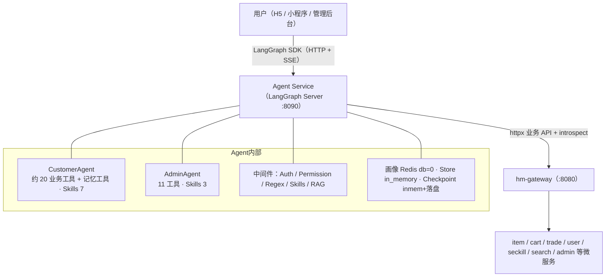

# hmall Agent 项目说明文档

> 本文档是 hmall Agent 的**入门总览**：说明设计动机、实现思路与最终效果。  
> 不含源码摘录、不含完整 `.env`、不含逐步部署手册；配置全文与验收清单见实现说明。

---

## 0. 文档导航

同目录下三份文档分工如下，阅读时可按「先总览 → 再契约 → 再落地」顺序使用：

| 文档 | 定位 | 适合谁 |
|------|------|--------|
| [hmall_Agent项目说明文档.md](./hmall_Agent项目说明文档.md)（本文） | **入门总览**：Why / 思路 / 效果，快速上手最小路径 | 首次接触项目、需要建立整体心智模型的读者 |
| [hmall_Agent设计方案文档.md](./hmall_Agent设计方案文档.md) | **Why / What 与契约**：架构选型、接口约定、RAG/画像/推荐等设计全文 | 做方案评审、对照设计做实现或排期的读者 |
| [hmall_Agent实现说明文档.md](./hmall_Agent实现说明文档.md) | **How**：配置全文、部署验收、与设计的偏差、工具/文件级细节 | 本地联调、排障、核对实现状态的读者 |

**交叉引用约定**：

- 本文只保留摘要表与必填项；完整工具表、完整环境变量、启动检查清单一律写「详见实现说明」。
- RAG 运维、知识库索引与开关细节详见设计方案 **Part A §12**；联调命令与验收项仍以实现说明为准。
- 若本文数量/端口与代码不一致，以当前代码与实现说明为准。

---

## 目录

1. [项目定位](#1-项目定位)
2. [总体架构](#2-总体架构)
3. [能力模块](#3-能力模块)
4. [快速上手](#4-快速上手)
5. [附录](#5-附录)

---

## 1. 项目定位

hmall Agent 是**枫叶商城**（hmall）的 AI 智能助手，基于 **DeepAgents + LangGraph** 构建：Python 侧负责对话编排、中间件路由与工具调用；业务数据一律经 HTTP 调用 Java 微服务集群完成。Agent 自身不承载商品/订单等业务库。

它面向两类角色：

- **C 端客服（CustomerAgent）**：用自然语言完成搜商品、秒杀、购物车、订单、地址与个性化推荐；对话越久越能记住未完成的购物意图，并在画像命中时更快给出偏好相关推荐。
- **管理后台助手（AdminAgent）**：用自然语言查询订单、商品、秒杀与用户数据，并一键生成运营日报；全只读，不执行写操作，与 C 端身份体系隔离。

相对「纯页面点选」的核心价值有三点：

1. **路径收敛**：把原本需要 3～5 次页面跳转的操作收进一轮对话。  
2. **个性化**：结构化画像（偏好）+ Layer 3 语义记忆（意图）+ 可选 RAG（政策文档），让回答既贴人又有据。  
3. **可控安全**：危险写操作走 Human-in-the-loop；身份以 Gateway introspect 为准；会话按 `owner` 多租户隔离。

---

## 2. 总体架构

### 2.1 部署拓扑

请求主路径可以概括为：前端 SDK 建连 Agent → 中间件完成鉴权/权限/捷径/技能（及可选 RAG）→ Agent 选择工具 → `GatewayClient` 携带同一 JWT 调用 Gateway → 下游微服务执行业务。会话状态落在 Checkpoint；跨会话偏好与意图分别落在 Redis 画像与 Store。

### 2.2 核心特点

| 特点 | 说明 |
|------|------|
| **三级路由** | L1 正则中间件（毫秒级）→ L2 `interrupt` 人机确认 → L3 LLM ReAct 兜底 |
| **双 JWT 体系** | C 端用户 JWT 与管理端 JWT 独立，互不串用；由 `agent_type` 选择探查路径 |
| **Gateway introspect** | Agent 通过 `GET /users/me` / `GET /admin/info` 向后端索取权威 `userId`，不以本地 base64 解码为权威 |
| **多租户会话隔离** | LangGraph Auth 按 `metadata.owner={agent_type}:{user_id}` 隔离 threads |
| **Agent 零业务库** | 不直连 MySQL；业务读写只走 Gateway → 微服务 API |
| **画像加速** | Redis 增量聚合画像（db=0，与后端共享）；命中时偏好分析可少走甚至免走业务聚合 |
| **Checkpoint / Store** | Checkpoint：`langgraph-runtime-inmem` + `.langgraph_api/*.pckl` 落盘；Store：`in_memory`（语义记忆） |

### 2.3 为什么不直连数据库？

hmall 是标准微服务拆分：商品、购物车、交易、用户等各有独立库与边界。若 Agent 直连各库，需要理解多套表结构与分布式一致性，耦合极高，且会绕过 Gateway 已有的鉴权、限流与业务校验。

通过 Gateway API，Agent 只消费稳定的业务契约（如搜索商品、读写购物车、下单），微服务内部改表或改存储对 Agent 透明。身份上，业务写路径仍由 Gateway / admin-service 再次验签，Agent 本地解析不会绑架真实 `userId`。这也是「Agent 零业务库」与「introspect 权威对齐」两条原则能够同时成立的基础。

---

## 3. 能力模块

本章各节统一采用「设计动机 / 实现思路 / 最终效果」三段式，描述能力边界与业务含义；实现级参数、文件清单与偏差说明见实现说明。

### 3.1 CustomerAgent（C 端客服助手）

#### 设计动机

日常购物中，用户常希望一句话说完「搜一下、加车、改数量、看订单、问推荐」，而传统 App 要在搜索、类目、购物车、订单页之间反复跳转。CustomerAgent 把这些高频操作收进自然语言对话，降低路径成本，并让「推荐 / 再看看」这类模糊意图也有承接方式。

#### 实现思路

基于 DeepAgents `create_agent` 声明式组装：约 **20 个业务工具**（商品 / 秒杀 / 购物车 / 订单 / 地址 / 推荐）+ **记忆工具**（`save_memory` / `get_memories`），配套 **7 个 Skills** 规范业务 SOP。工具原则是：

- **一工具一 API**：参数与后端接口对齐，边界清晰。  
- **可读返回**：经格式化转为中文 Markdown，而不是把裸 JSON 丢给用户。  
- **危险操作走 interrupt**：真正写 API 前先二次确认或补齐参数。  

中间件链负责鉴权注入、管理/C 端权限差异（对 C 端主要是放行写工具）、正则捷径与技能加载；可选 RAG 在开关打开时动态注入检索工具。

#### 最终效果

- 「搜 2000 以内蓝牙耳机」→ 商品列表类 Markdown 结果  
- 「把第一个加购物车 / 改数量 / 看订单」→ 对应工具调用并返回确认文案  
- 「帮我推荐适合我的」→ 先偏好分析再推荐，并附推荐理由  
- 未完成意图可写入记忆，下次对话自然接上  

### 3.2 AdminAgent（管理助手）

#### 设计动机

运营人员查看订单、库存、秒杀效果时往往要跨多个后台页筛选。自然语言查询可以把「看数据」从点选劳动变成一句话任务；日报类需求则适合一次组合查询，避免人工逐页抄数。

#### 实现思路

与 CustomerAgent **共用同一套中间件骨架**，差异在权限与工具集：

- **全只读**：`PermissionMiddleware` 过滤写操作工具，管理端不可下单、不可改车。  
- **11 个工具**：10 个查询（商品 / 订单 / 秒杀 / 用户）+ `generate_daily_report` 组合编排（并发拉取多维只读数据后聚合成日报）。  
- **3 个 Skills**：日报、数据查询、RAG 查询。  
- **独立 JWT**：管理端身份与 C 端隔离，introspect 走 `GET /admin/info`。

#### 最终效果

- 「查看某秒杀活动参与情况」→ 活动/订单/库存维度可读汇总  
- 「生成今天运营日报」→ 多路只读查询聚合为结构化日报  
- 「查商品库存 / 用户详情」→ 分页或详情类查询结果  
- 即使模型误选写工具，也会在权限层被挡住  

### 3.3 三级路由（中间件体系）

#### 设计动机

输入形态差异极大：有的是固定口令（「我的订单」），有的是危险写操作（「取消订单」），有的是模糊导购（「送女朋友预算 500」）。全部走 LLM 则简单指令也慢；全部正则则灵活度不够。需要在速度与灵活度之间分层。

#### 实现思路

| 层级 | 机制 | 典型场景 |
|------|------|----------|
| **L1** | `RegexShortcutMiddleware`，毫秒级意图→工具 | 「我的订单」「秒杀活动」等高频只读/捷径 |
| **L2** | LangGraph `interrupt()` 状态机 | 取消订单、清空购物车、秒杀下单、地址采集等需确认或补参 |
| **L3** | LLM ReAct 完整推理 | 模糊需求、多步规划、L1/L2 未命中 |

中间件顺序大体为：鉴权（introspect 注入 `user_id`）→ 权限过滤 → 正则捷径 → Skills →（可选）RAG 动态工具注入。L1 命中时可跳过昂贵的模型调用；未命中再交给后续层，保证「能快则快、该慎则慎、其余交给模型」。

#### 最终效果

- 高频口令可跳过 LLM，体感接近「点按钮」  
- 危险操作必现确认弹窗，降低误操作  
- 复杂导购仍由 LLM 规划多工具协作  
- 同一条中间件链可服务 Customer / Admin，差异主要在工具注册表与权限过滤  

### 3.4 工具与 Skills 摘要

#### 设计动机

工具负责「能调用什么 API」；Skills 负责「在什么场景应按什么 SOP 使用工具」。二者分离，避免把全部业务规范塞进系统 Prompt 撑爆上下文，也便于按场景独立迭代规范而不改工具代码。

#### 实现思路

**CustomerAgent 工具分类（数量摘要）**

| 分类 | 约数量 | 能力摘要 |
|------|--------|----------|
| 商品浏览 | 3 | 搜索 / 详情 / 分页 |
| 秒杀 | 3 | 活动列表 / 商品详情 / 下单（需确认） |
| 购物车 | 5 | 查 / 加 / 改数量 / 删 / 清空（删/清空需确认） |
| 订单 | 4 | 列表 / 详情 / 取消 / 确认收货（后两者需确认） |
| 地址 | 3 | 列表 / 新增（多轮） / 修改 |
| 个性化推荐 | 2 | 偏好分析 / 推荐列表 |
| 用户记忆 | 2 | 保存 / 读取 Layer 3 记忆 |
| **合计** | **约 20 业务 + 记忆工具** | 完整工具名与参数见实现说明 |

**AdminAgent 工具分类（数量摘要）**

| 分类 | 数量 | 能力摘要 |
|------|------|----------|
| 商品管理查询 | 2 | 分页 / 详情 |
| 订单管理查询 | 2 | 分页 / 详情 |
| 秒杀管理查询 | 4 | 活动 / 关联商品 / 订单 / 库存 |
| 用户管理查询 | 2 | 分页 / 详情 |
| 运营日报 | 1 | `generate_daily_report` 组合编排 |
| **合计** | **11（10 查询 + 日报）** | 完整工具表见实现说明 |

**Skills 摘要**

| Agent | 数量 | Skill 主题 |
|-------|------|------------|
| CustomerAgent | 7 | 购物导购、秒杀下单、购物车、订单、地址、个性化推荐、RAG 查询 |
| AdminAgent | 3 | 运营日报、数据查询、RAG 查询 |

Skills 以 `SKILL.md` 形式存放在工作区虚拟文件系统中，由 `SkillsMiddleware` 按场景注入为动态规范。工具侧还可做预处理降级（例如秒杀版本黑名单、空数据固定提示），减少无效 LLM 推理。

#### 最终效果

- 工具返回面向用户的 Markdown，而不是裸 JSON  
- 秒杀降级、空数据提示等可在工具层完成，减轻模型负担  
- Skill 约束「先详情再下单」「推荐必附理由」等业务纪律  
- 完整工具参数表与返回约定不在本文展开，**详见实现说明**  

### 3.5 用户画像持久化

#### 设计动机

若每次推荐都实时查订单/购物车再跨服务聚合，延迟高且 Agent 与后端推荐服务会重复计算。需要一层「行为发生时增量写、读取时直接取」的共享画像，让对话入口与页面入口共用同一偏好事实源。

#### 实现思路

- **存储**：Redis **db=0**，与后端 `spring.redis.database=0` 共享。  
- **写入（后端）**：加购、支付成功等路径增量更新类目/品牌/价格与统计；Agent 调用加购/下单 API 成功后由后端联写，Agent 不重复写画像。  
- **读取（Agent / 推荐）**：优先读画像；miss 再降级实时聚合并回写。  

逻辑结构可理解为（具体 Key/TTL 以实现说明与代码为准）：

| 维度 | 内容概要 |
|------|----------|
| 行为流 | 近期加购/购买等事件摘要 |
| 类目 / 品牌分 | 累计偏好得分，供 TopN 使用 |
| 价格样本 | 近期成交或相关价格，用于价格带估计 |
| 统计字段 | 购买/加购次数、最近更新时间等 |

画像记住的是结构化偏好，不是完整对话文本；后者属于 Layer 3 记忆或 Checkpoint 会话历史。

#### 最终效果

- 偏好分析在画像命中时接近本地 Redis 读取延迟，少绕业务聚合  
- 无论用户通过 Agent 对话还是前端页面加购/下单，画像路径可一致更新  
- 为推荐与「为什么推荐这些」的可解释性提供同一数据源  

### 3.6 个性化推荐

#### 设计动机

教学级商城的目标不是上线最复杂的协同过滤 CTR 最优模型，而是让 Agent「像懂用户的导购」：先懂偏好，再召回商品，再用自然语言说清理由，并与后续加购/详情动作无缝衔接。

#### 实现思路

三步管线：

1. **偏好分析**：画像命中则直接取 Top 类目/品牌/价格带；miss 则查订单/购物车加权聚合。  
2. **召回排序**：按偏好条件检索候选商品，并处理库存/状态、已购排除等业务约束。  
3. **理由生成**：由 LLM 结合偏好与商品信息生成可解释理由，而非纯模板拼接。  

Agent 侧典型路径是先 `analyze_user_preferences`，再 `get_recommendations_api`；Skills 中的个性化推荐规范约束「先分析、后推荐、每条附理由、说明数据来源」。

#### 最终效果

- 「帮我推荐」→ 若干推荐商品 + 个性化理由  
- 用户可追问「为什么推荐这些」→ 可回溯到偏好分析摘要  
- 推荐结果可继续衔接「看详情 / 加购」等对话动作  

### 3.7 语义记忆（Layer 3）

#### 设计动机

画像只能表达「喜欢什么类目/品牌」，记不住「想买手机但再看看」这类未完成意图。若每次开聊都从零开始，体验像失忆导购。需要在结构化偏好之上再增加一层「意图/备注」记忆。

#### 实现思路

在 Redis 结构化画像之上增加 **LangGraph Store** 语义记忆层：

- `save_memory`：保存明确但未完成的意图或偏好备注  
- `get_memories`：对话开始时读取，供模型自然融入回复  

当前 `graph.json` 配置 **Store `type: in_memory`**，可按平台能力扩展持久化后端。注意与 Checkpoint 区分：Checkpoint 管的是某个 thread 的对话状态恢复；Store 管的是按用户维度的跨会话记忆条目。多租户下记忆 namespace 绑定当前用户，避免串读。

#### 最终效果

- 上次说「改天再看手机」→ 下次可被自然提起，而不是机械复读  
- 换 thread 不自动带上旧消息气泡，但记忆与画像可按 `user_id` 跨会话保留  
- 与 Redis 画像分工清晰：偏好 vs 意图  

### 3.8 RAG 知识库集成

#### 设计动机

退换货、配送、支付方式等政策类问题不在商品库里。若仅靠 LLM 编造，容易出现虚假期限与错误流程。需要可检索的运营文档作为依据，把「会说」变成「有据可依」。

#### 实现思路

通过 MCP 桥接 LightRAG：Agent 侧按需注入检索类工具；前端可用「知识库」开关控制是否启用。知识图谱 + 向量检索返回片段后，由 LLM 基于片段作答。Customer / Admin 各自有 `rag-query` Skill，约束政策类问题先检索再回答。

运维、索引、端口与开关细节较多，**完整说明见设计方案文档 Part A「§12 RAG 知识库」**；本地联调步骤与验收项见实现说明。本文只强调：RAG 可选、按需启用、不启用时应接近零开销。

#### 最终效果

- 「能货到付款吗 / 退货怎么处理」→ 基于文档回答，降低幻觉  
- 不启用时可不拉起 MCP，避免无关开销  
- 与商品工具并存：商品事实走业务 API，政策事实走知识库  

### 3.9 Human-in-the-loop（二次确认）

#### 设计动机

取消订单、确认收货、清空购物车、秒杀下单等不可逆或高风险操作，不能由模型「直接替用户决定」。必须让用户看见确认意图后再执行，把「自动驾驶」限制在可逆、低风险范围内。

#### 实现思路

危险工具在执行前调用 LangGraph `interrupt()` 暂停图执行；前端弹出确认 UI，用户确认后恢复 run，取消则中止。地址新增等还可能用 interrupt 做多轮字段采集（缺省信息不猜全）。

典型需确认或补参场景包括：取消订单、确认收货、删除购物车项、清空购物车、秒杀下单，以及地址相关的多轮交互。AdminAgent 因全只读，通常不进入写操作 HITL，但查询类多轮补参仍可复用 interrupt 思路（以实现为准）。

#### 最终效果

- 写操作有明确确认步骤，降低误触与模型误判  
- 确认文案携带关键业务 ID（如订单号），用户可核对  
- 与 L1 捷径、L3 推理兼容：确认发生在真正调用写 API 之前  

### 3.10 前端集成

#### 设计动机

Agent 需要的不只是聊天框，还包括 JWT 注入、流式渲染、工具过程可见、interrupt 弹窗，以及按登录身份隔离会话列表。否则「能聊」但不可用：要么越权，要么确认断层，要么换号串会话。

#### 实现思路

前端通过 `@langchain/langgraph-sdk` 以 HTTP + SSE 连接 Agent（默认 `:8090`）。关键约定：

- 请求携带 `Authorization` 与 `X-Hmall-Agent-Type`。  
- 业务 token 同时进入 LangGraph Auth（多租户 + introspect）与工具侧 `context.user_token`（调 Gateway）。  
- 创建/搜索 thread 写入或过滤 `metadata.owner`。  
- 换账号清空本地 `threadId`，避免沿用他人会话 ID。  
- Markdown 中的商品链接由前端解析为可点击跳转；interrupt 与原生确认 UI 打通。  

#### 最终效果

- 流式文本与工具结果交替展示，体感接近实时客服  
- 商品类 Markdown 可解析为可点击跳转  
- interrupt 确认与前端 UI 一体，无需另造协议  
- 用户只能看到自己的会话列表  

### 3.11 后端集成与安全（introspect + 多租户）

#### 设计动机

Agent 是独立入口（浏览器直连 `:8090`），**收不到** Gateway 转发头里的 `user-info`。若只本地解码 JWT，则与 Gateway 验签结果「碰巧一致」不可靠，也无法继承黑名单/过期等后端能力。同时，若不按用户隔离 thread，知道 `thread_id` 就可能越权读会话。因此需要「身份权威对齐」与「会话归属强制」两道闸。

#### 实现思路

**业务调用**：`GatewayClient`（httpx）统一访问 `JAVA_GATEWAY_URL`，工具携带同一 JWT；Gateway 验签后下游读 `UserContext`。画像写入仍由后端在加购/支付等路径完成，覆盖 Agent 与页面两种入口。

**身份权威（introspect）**：

| 端 | 权威接口 | 含义 |
|----|----------|------|
| C 端 | `GET /users/me` | Gateway 验签后返回官方 `userId` |
| 管理端 | `GET /admin/info` | admin-service 侧权威管理员 ID |

默认短 TTL 缓存 introspect 结果，降低 threads API 额外往返；失败时默认不静默回退本地解码（保持与 Gateway 强一致）。该 `userId` 用于 Auth 的 `owner`、画像 Key、记忆 namespace，以及中间件写入的 `context.user_id`。本地 JWT 解析仅可用于猜测 introspect 路径或可选回退，**默认不是权威**。

**多租户会话**：自定义 LangGraph Auth——鉴权得到 `owner={agent_type}:{user_id}`；threads 的创建/搜索/读写/跑流均按 `owner` 过滤。Checkpoint 由 **langgraph-runtime-inmem** 托管，冷路径 pickle 到工作目录 **`.langgraph_api/*.pckl`**（不是 Redis Checkpoint）。这与早期文档中的「Redis Checkpoint」表述不同，以当前实现为准。

#### 最终效果

- 伪造 payload 的假 JWT：introspect 被拒 → 进不了受保护会话 API  
- 用户 A 无法用自己的 token 操作用户 B 的 thread  
- 业务写路径仍经 Gateway，身份不被 Agent 本地解析绑架  
- 进程重启后，落盘 Checkpoint 仍可能恢复既有会话（开发态行为以实现与平台版本为准）  

---

## 4. 快速上手

本节只给「能跑起来」的最小路径。完整配置全文、启动顺序与验收检查清单见 [hmall_Agent实现说明文档.md](./hmall_Agent实现说明文档.md)。

### 4.1 环境要求

- Python ≥ 3.12，包管理建议使用 uv  
- Redis 可用（用户画像，**db=0** 与后端一致）  
- hmall Java 微服务与 **Gateway** 已启动（Agent 不直连业务库）  
- 可用的通义千问（DashScope）API Key  
- 前端联调时还需对应门户/管理端前端工程与登录态  

### 4.2 最小三步启动

1. **安装依赖**：进入 `hmall-agent` 目录执行依赖同步（如 `uv sync`）。  
2. **配置环境**：复制 `.env.example` 为 `.env`，至少填好下表必填项。  
3. **启动 Agent**：运行 `start_server.py`（或项目约定的等价启动命令），确认健康检查可用。  

建议依赖顺序的心智模型是：基础设施（MySQL / Redis / Nacos / MQ 等）→ Java 微服务与 Gateway → Agent → 前端。逐步命令、健康检查项与常见失败点**详见实现说明**，本文不展开成部署手册。

RAG 为可选能力：需额外启动 LightRAG 与 RAG MCP 服务，并在前端打开知识库开关；设计细节见设计方案 RAG 章节，联调见实现说明。

### 4.3 必填配置摘要

| 配置项 | 作用 |
|--------|------|
| `DASHSCOPE_API_KEY` | LLM（通义千问）调用密钥 |
| `JAVA_GATEWAY_URL` | hmall Gateway 根地址（业务 API + introspect） |
| `AGENT_PORT` | Agent / LangGraph Server 监听端口（默认 8090） |
| 画像 Redis 相关 | `REDIS_HOST` / `REDIS_PORT` / `REDIS_PASSWORD` / `PROFILE_REDIS_DB`（须为 **0** 且与后端一致） |
| introspect 相关 | 如 `INTROSPECT_CACHE_TTL`、`INTROSPECT_FALLBACK_JWT`（默认失败不回退本地解码） |

完整 `.env` 项、JWT/JKS、RAG、日志等级等说明见实现说明，本文不展开。

### 4.4 端口速查

| 服务 | 默认端口 | 说明 |
|------|----------|------|
| Agent / LangGraph | 8090 | API / Docs / Studio / 健康检查入口 |
| hm-gateway | 8080 | 业务 API 与 introspect 入口 |
| RAG MCP（可选） | 8008 | Agent 侧 MCP 桥 |
| LightRAG（可选） | 9621 | 知识检索引擎 |

### 4.5 完整配置与检查清单

本地联调建议按实现说明中的顺序完成依赖启动后，至少验证：登录态是否能通过 introspect、会话列表是否按 owner 隔离、C 端读写工具与 Admin 只读边界、画像/推荐是否可用，以及（可选）RAG 开关与检索是否生效。**完整配置与检查清单见实现说明**。

---

## 5. 附录

### 5.1 术语表

| 术语 | 含义 |
|------|------|
| CustomerAgent | C 端客服助手图，面向购物全链路对话 |
| AdminAgent | 管理助手图，只读查询 + 运营日报 |
| 三级路由 | L1 正则捷径 → L2 interrupt 确认 → L3 LLM 兜底 |
| Skill / SKILL.md | 场景化业务 SOP，由 Skills 中间件注入 |
| Gateway introspect | 用业务 JWT 调 `/users/me` 或 `/admin/info` 获取权威用户 ID |
| owner | 多租户会话归属键，格式 `{agent_type}:{user_id}` |
| Checkpoint | 会话状态持久化；当前为 inmem 运行时 + `.langgraph_api` 落盘 |
| Store | LangGraph 键值/语义存储；当前 `in_memory`，承载 Layer 3 记忆 |
| 用户画像 | Redis 结构化偏好（类目/品牌/价格等），与后端共享 db=0 |
| Layer 3 记忆 | 对话级意图/备注记忆，区别于画像偏好 |
| HITL | Human-in-the-loop，危险操作二次确认 |
| RAG | 基于知识库检索增强生成，降低政策类幻觉 |
| MCP | Model Context Protocol，本文用于桥接 LightRAG 工具 |
| DeepAgents | 声明式 Agent 组装框架，提供 Skills 等中间件能力 |
| LangGraph | 图执行与状态持久化运行时，提供 Server / Auth / interrupt 等能力 |

### 5.2 相关文档索引

| 文档 | 内容侧重 |
|------|----------|
| [hmall_Agent设计方案文档.md](./hmall_Agent设计方案文档.md) | 架构与技术选型、接口与安全契约、推荐/画像/RAG 设计全文 |
| [hmall_Agent实现说明文档.md](./hmall_Agent实现说明文档.md) | 实现细节、完整工具表、完整配置、部署验收、与设计偏差 |
| 本文 | 入门总览与快速上手最小路径 |

---

*本文档描述 hmall Agent v2.0+（含多租户 Auth 与 Gateway introspect）的入门视角；数量与端口以当前代码为准，细节冲突时以实现说明与代码为准。*
