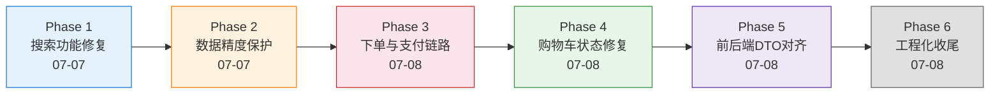

# hmall 项目修改记录

> 本文档记录了 2026-07-07 至 2026-07-08 期间对 hmall（黑马商城）前后端项目的全部修改，涵盖搜索、下单、支付、类型对齐、精度保护、工程化等模块。

---

## 1. 总览

| 项目 | 数据 |
|------|------|
| 时间跨度 | 2026-07-07 ~ 2026-07-08 |
| 修改文件 | 20+ 文件（前后端） |
| 涉及模块 | search-service, trade-service, pay-service, item-service, cart-service, hm-common, hmall-frontend |
| 核心领域 | ES 搜索修复、雪花 ID 精度保护、前后端 DTO 对齐、下单/支付链路修复、购物车状态管理 |

### 演进阶段总览



---

## 2. Phase 1: 搜索功能修复（2026-07-07）

> **目标**：修复搜索页面"总商品数恒为 10000"、"筛选后总数不变"、"无分页条"、"价格排序不生效"四个问题。

### 2.1 搜索总数恒为 10000，筛选后不变

**根因**：`SearchServiceImpl.search()` 未启用 `trackTotalHits(true)`，ES 7.x 默认只精确统计到 10000 条，超出返回 `total.value = 10000`。

**文件**：`hmall/search-service/.../SearchServiceImpl.java`

**修复**：
```java
// searchSourceBuilder.query(...) 之后，search() 之前加一行
searchSourceBuilder.trackTotalHits(true);
```

### 2.2 无分页条

**分析**：`SearchPage.vue` 源码中已包含完整的 `<el-pagination>`（第 145-154 行），条件 `v-if="total > 0"` 与头部"共 {{total}} 件"使用同一 ref。逻辑上两者一定同时出现。

**结论**：如能看到共 10000 件但无分页条，说明运行的是旧版 nginx jQuery `search.html`（仅 prev/next 箭头），而非 Vue `SearchPage.vue`。Vue 代码本身正确。

### 2.3 价格排序不生效

**根因**：`SearchServiceImpl.search()` 第 110-111 行硬编码排序为 `_score DESC, update_time DESC`，完全忽略了前端传入的 `sortBy` / `isAsc` 参数。

**修复**：改为动态排序——

```java
String sortBy = query.getSortBy();
if (StringUtils.hasText(sortBy)) {
    SortOrder order = Boolean.TRUE.equals(query.getIsAsc()) ? SortOrder.ASC : SortOrder.DESC;
    searchSourceBuilder.sort(new FieldSortBuilder(sortBy).order(order));
} else {
    searchSourceBuilder.sort("_score", SortOrder.DESC);
    searchSourceBuilder.sort(new FieldSortBuilder("update_time").order(SortOrder.DESC));
}
```

---

## 3. Phase 2: 数据精度保护（2026-07-07 ~ 2026-07-08）

> **目标**：解决雪花 ID（19 位）经 JSON 序列化后，JS Number 精度丢失导致订单/支付 ID 错误的问题；同时保证分页数值（total/pages）以数字形式传递。

### 3.1 Long → String 全局序列化

**背景**：`JsonConfig.java` 将所有 `Long` 序列化为 String，保护 JS `Number.MAX_SAFE_INTEGER`（16 位）之外的雪花 ID，但副作用是 `PageDTO.total/pages` 也变成了字符串。

### 3.2 PageDTO Long → Integer

**文件**：`hmall/hm-common/.../PageDTO.java`

**修复**：`total` / `pages` 字段从 `Long` 改为 `Integer`，所有 `of()` / `empty()` 工厂方法中用 `.intValue()` 转换。分页数值不存在超限风险。

### 3.3 恢复 Long → String 并配合 PageDTO Integer

最终方案：保留 `Long → String`（保护雪花 ID）+ `PageDTO.total/pages` 为 `Integer`（数字传给前端）。

**文件**：
- `hmall/hm-common/.../JsonConfig.java`：保留 `serializerByType(Long.class, ToStringSerializer.instance)`
- `hmall/hm-common/.../PageDTO.java`：total/pages 改为 Integer

### 3.4 前端雪花 ID 类型对齐

**文件**：
- `hmall-frontend/src/types/index.ts`
- `hmall-frontend/src/api/order.ts`
- `hmall-frontend/src/api/pay.ts`
- `hmall-frontend/src/views/portal/PayPage.vue`

**修复**：

| 字段 | 类型变更 |
|------|---------|
| `OrderVO.id` | `number → string` |
| `PayOrderFormDTO.id` | `number → string` |
| `PayApplyDTO.bizOrderNo` | `number → string` |
| `PayOrderVO.id, bizOrderNo` | `number → string` |
| `createOrder()` 返回值 | `Promise<number> → Promise<string>` |
| `getOrderById()` 参数 | `id: number → id: string` |
| `tryPayOrderByBalance()` 参数 | `id: number → id: string` |
| `PayPage.orderId` | `Number(route.params.orderId)` → 直接使用字符串 |

### 3.5 `applyPayOrder` 返回值精度丢失

**根因**：后端 `applyPayOrder()` 返回 Java `String` → Spring 使用 `StringHttpMessageConverter` 输出 `text/plain`。Axios 默认 `responseType: 'json'` 对 `text/plain` 做 `JSON.parse()`，裸数字字符串被解析为 JS Number → 精度丢失。

**文件**：`hmall-frontend/src/api/pay.ts`

**修复**：指定 `responseType: 'text'`
```typescript
return request.post('/pay-orders', data, { responseType: 'text' })
```

---

## 4. Phase 3: 下单与支付链路（2026-07-08）

> **目标**：修复下单 500、支付页面无金额/无支付单、支付时 payOrderId 精度错误等问题。

### 4.1 创建订单返回 500

**分析**：`OrderServiceImpl.createOrder()` 内部依赖三个外部服务——Feign 调用 item-service、数据库操作、RabbitMQ 发送延迟消息。任一不可用即 500。

| 可能原因 | 排查方式 |
|---------|---------|
| item-service 未启动 | FeignException / ConnectException |
| RabbitMQ 未启动 | AmqpException |
| Seata Server 未启动 | GlobalTransactional 失败 |

### 4.2 订单商品 ID 错位：购物车条目 ID ≠ 商品 ID

**根因**：`OrderConfirm.vue` 中 `item.id` 是购物车条目 ID（CartItem.id），而非商品 ID（CartItem.itemId）。传入 `createOrder` 的 `itemId` 错误 → 后端查不到商品。

**文件**：
- `hmall-frontend/src/types/index.ts`：`CartItem` 补全 `itemId` 字段
- `hmall-frontend/src/views/portal/OrderConfirm.vue`：`item.id` → `item.itemId`

### 4.3 支付页面金额 0.00 + `pay-orders/undefined`

**根因**：`POST /pay-orders`（生成支付单）从未被调用过。`createOrder` 只创建业务订单，PayPage 无法查到支付单 → `getPayOrderByBizOrderNo` 返回 null → `payOrderRes.id = undefined`。

**文件**：
- `hmall-frontend/src/types/index.ts`：`PayApplyDTO` 补全 `amount`/`payType`/`orderInfo`
- `hmall-frontend/src/views/portal/PayPage.vue`：`onMounted` 中创建支付单

**修复后的支付流程**：
```
PayPage.onMounted → getOrderById（拿金额+订单号）
                 → applyPayOrder({ bizOrderNo, amount, payType:5, ... })  // 补上生成支付单
                 → payByBalance → tryPayOrderByBalance(payOrderId, ...)
```

---

## 5. Phase 4: 购物车状态修复（2026-07-08）

> **目标**：修复结算页商品清单为空、购物车图标无 Badge 等问题。

### 5.1 结算页商品清单为空

**根因**：`PortalLayout` 是每个页面的局部组件，路由切换时重新挂载 → `onMounted` 无条件调用 `fetchCartList()` → 后端数据覆盖了 CartPage 中通过 `toggleCheck` 设置的本地 `checked` 状态 → `checkedItems` 为空。

**文件**：`hmall-frontend/src/views/portal/PortalLayout.vue`

**修复**：仅在 `cartList.length === 0` 时拉取
```typescript
if (userStore.isLogin && cartStore.cartList.length === 0) {
    await cartStore.fetchCartList()
}
```

### 5.2 顶部两个"我的订单"

**修复**：`PortalLayout.vue` 中 `to="/portal/home"` 的链接文字从"我的订单"改为"首页"（原为复制粘贴错误）。

---

## 6. Phase 5: 前后端 DTO 对齐（2026-07-08）

> **目标**：扫描前端所有 POST/PUT 请求体类型，确保与后端 DTO 字段一一对应。

### 6.1 CartFormDTO 缺失字段

**后端需要**：`itemId, name, spec, price, image`

**前端原来只有**：`itemId`

**文件**：
- `hmall-frontend/src/types/index.ts`：补全 4 个字段
- `hmall-frontend/src/views/portal/SearchPage.vue`：`addToCart` 传入完整字段

### 6.2 全项目 DTO 扫描结果

| 端点 | 前端类型 | 结论 |
|------|---------|------|
| `POST /carts` | `CartFormDTO` | ✅ 已修复 |
| `POST /orders` | `OrderFormDTO` | ✅ 完整，OrderConfirm 正确使用 |
| `POST /pay-orders` | `PayApplyDTO` | ⚠️ 缺 3 个字段（死代码，后补全） |
| `POST /pay-orders/{id}` | `PayOrderFormDTO` | ✅ 完整 |
| `POST /users/login` | `LoginFormDTO` | ⚠️ 缺可选 `rememberMe`（无影响） |
| `PUT /carts/{id}` | `{ num }` | ✅ MP `not_null` 策略正常 |

---

## 7. Phase 6: 工程化收尾（2026-07-08）

### 7.1 Git 排除 target 目录

**操作**：
- `.gitignore` 新增 `**/target/` 规则
- `git rm -r --cached` 移除 10 个子模块的 254 个已跟踪 target 文件（本地保留）

### 7.2 AI Agent 可行性分析

**结论**：架构完全可行。现有基础设施（Nacos/ES/Redis/RabbitMQ/MySQL/Spring Cloud）充分复用，需新建 `ai-agent-service` 微服务 + Spring AI 接入大模型。

**主要缺口**：浏览/点击/搜索行为埋点数据（当前空白），需新建采集链路。

---

## 8. 文件变更分布

| 文件 | 修改主题 |
|------|---------|
| `hmall/search-service/.../SearchServiceImpl.java` | 搜索排序、trackTotalHits |
| `hmall/hm-common/.../JsonConfig.java` | Long→String 序列化 |
| `hmall/hm-common/.../PageDTO.java` | total/pages Long→Integer |
| `hmall/pay-service/.../PayOrderFormDTO.java` | id Long→String（后被用户还原） |
| `hmall/pay-service/.../PayController.java` | setId 适配 |
| `hmall/pay-service/.../PayOrderServiceImpl.java` | getId 转换 |
| `hmall/hm-service/.../PayOrderFormDTO.java` | 同步 pay-service 改动 |
| `hmall/hm-service/.../PayController.java` | 同步 pay-service 改动 |
| `hmall/hm-service/.../PayOrderServiceImpl.java` | 同步 pay-service 改动 |
| `hmall/hm-service/.../OrderServiceImpl.java` | 依赖分析（无代码改动） |
| `hmall-frontend/src/types/index.ts` | CartItem/CartFormDTO/PayApplyDTO/OrderVO/PayOrderVO/PayOrderFormDTO |
| `hmall-frontend/src/api/order.ts` | createOrder/getOrderById 返回值/参数类型 |
| `hmall-frontend/src/api/pay.ts` | responseType:'text' / 参数类型 |
| `hmall-frontend/src/views/portal/SearchPage.vue` | addToCart 完整字段 |
| `hmall-frontend/src/views/portal/OrderConfirm.vue` | itemId 修正 |
| `hmall-frontend/src/views/portal/PayPage.vue` | 生成支付单 / 雪花ID字符串 |
| `hmall-frontend/src/views/portal/PortalLayout.vue` | fetchCartList 条件 / 链接文字 |
| `hmall-frontend/src/stores/cart.ts` | 引用类型（无改动） |
| `.gitignore` | target 目录排除 |

---

## 9. 总结

在 2 天内通过 20+ 处修改，解决了 hmall 的六个核心问题域：

1. **搜索准确性**：修复 ES 10000 上限和排序硬编码，搜索体验恢复正常
2. **数据精度**：建立"后端 Long→String + PageDTO Integer + 前端 string 类型"三层防护，雪花 ID 全程无损
3. **下单链路**：修复商品 ID 错位（购物车条目 ≠ 商品 ID），订单可正常创建
4. **支付链路**：补上缺失的 `applyPayOrder` 调用，打通"下单→支付单→支付"闭环
5. **购物车状态**：修复路由切换时 fetchCartList 覆盖本地 checked 状态
6. **DTO 对齐**：前后端类型全面对齐，消除 4 处字段缺失

---

*文档更新时间：2026-07-08*
